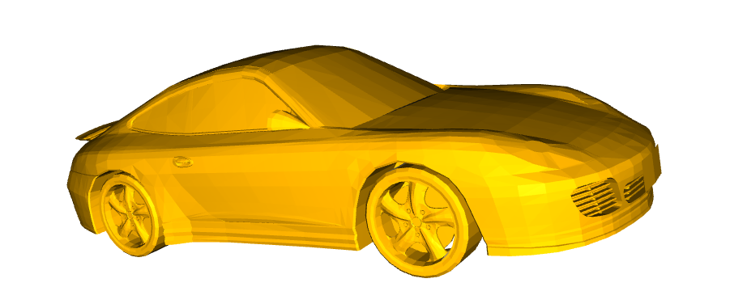
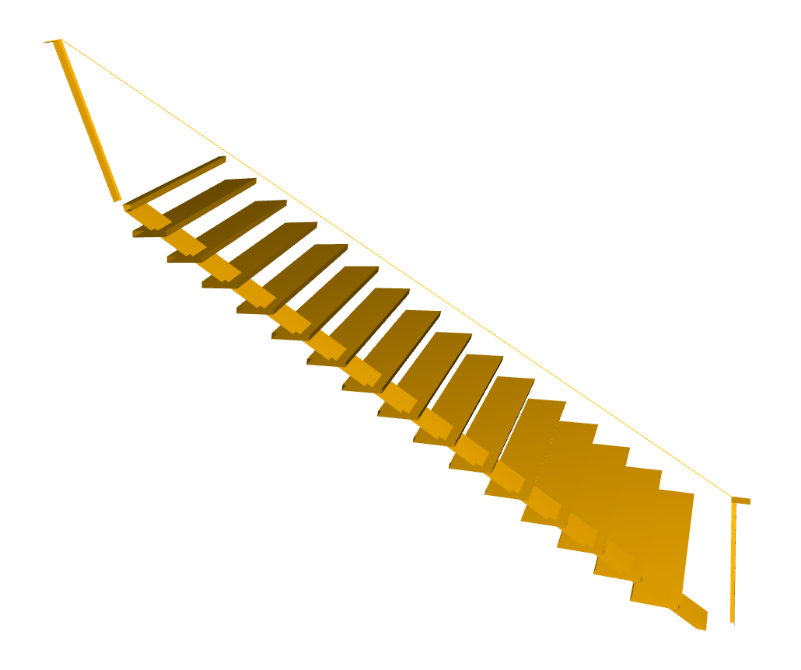
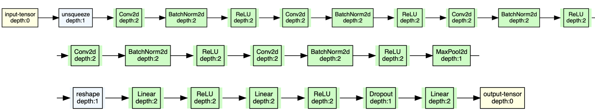
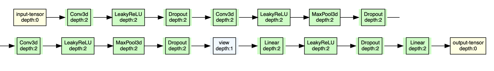
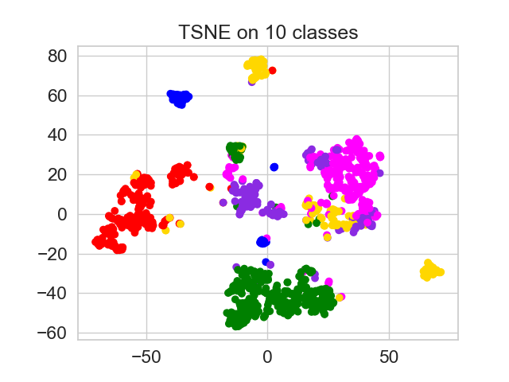

# 3D-Object-Classification
 
## Dataset 
We employ the [ModelNet40](https://modelnet.cs.princeton.edu/)[1] dataset for our experiments. The dataset contains 12,311 3D models of 40 categories. The models are represented as point clouds with 3D coordinates and 3D normals.
Example of the dataset:

<p align="float">
  
  
    
  

</p>

### Binvox [3][4]
Voxels indices are listed in the ModelNet40 as .off files, in order to process voxels as 3D volumes we apply a binvox[3] conversion.
The binvox conversion is done using the following command:
```
cd binvox_utils
chmod +x binvox
python3.9 off2binvox.py
```
Note that the binary file binvox in the binvox_utils folder is compiled for OSX, if you are using a different OS you need to compile it from the source code, available [here](https://www.patrickmin.com/binvox/).

## Architectures
We test two main architectures for 3D object classification: one based on PointCloud data and one based on Voxel data.
Moreover, we test a further approach, based on autoencoder reconstruction of the input point cloud.

### 1. PointNet
The architecture of PointNet is shown below:

<p align="center">
  
</p>

#### Test
| Accuracy | Precision | Recall | F1 |
| --- | --- | --- | --- |
| 0.81  |  0.71|   0.71  |  0.70 | 

### 2. VoxelNet
Another approach is to use the voxel representation of the 3D models. We use the binvox conversion to convert the .off files into .binvox files. The architecture of VoxelNet is based on convolutional layers, as shown below:
<p align="center">
  
</p>


#### Test
| Accuracy | Precision | Recall | F1 |
| --- | --- | --- | --- |
| 0.79 | 0.66 | 0.67 | 0.64 |


#### VoxelNet with residual connections:
| Accuracy | Precision | Recall | F1 |
| --- | --- | --- | --- |
| 0.83  |  0.72|   0.74  |  0.72 | 


### 3. Autoencoder reconstruction
We train an autoencoder to reconstruct the input point cloud. The architecture of the autoencoder is inspired from Folding Net [6]. The codewords are used as features for the classification task, which can be performed using a simple MLP or SVM.

For visualization purposes, we use T-SNE to reduce the dimensionality of the codewords to 2D. The following figure shows the T-SNE visualization of the codewords of the autoencoder trained on the ModelNet40 dataset:

<p align="center">
  
</p>

#### Training
| Model | Accuracy | Precision | Recall | F1 |
| --- | --- | --- | --- | --- |
| SVM |  0.95775  |   0.937213   |   0.956921  |   0.945411 |  
| FFNN | 0.89975   |  0.8533   |   0.890944   |  0.859089  | 


#### Testing
| Model | Accuracy | Precision | Recall | F1 |
| --- | --- | --- | --- | --- |
| SVM |  0.814  |  0.73988  |   0.755867  |  0.742402 | 
| FFNN | 0.7885  |  0.710157   |  0.737134  |  0.712737 | 


## References
[1]. K. F. Y. L. Z. X. T. Z. Wu, S. Song and J. Xiao, 3D ShapeNets: A Deep Representation for Volumetric Shapes. Proceedings of 28th IEEE, Conference on Computer Vision and Pattern Recognition (CVPR2015).

[2] Q.-Y. Zhou, J. Park, and V. Koltun, “Open3D: A modern library for 3D data processing,” arXiv:1801.09847, 2018.

[3] P. Min, “binvox.” http://www.patrickmin.com/binvox or https://www.google.com/search?q=binvox, 2004 - 2019. 

[4] F. S. Nooruddin and G. Turk, “Simplification and repair of polygonal models using volumetric techniques,” IEEE Transactions on Visualization and Computer Graphics, vol. 9, no. 2, pp. 191–205, 2003.

[5] C. R. Qi, H. Su, K. Mo, and L. J. Guibas, “Pointnet: Deep learning on point sets for 3d classification and segmentation,” CoRR, vol. abs/1612.00593, 2016.

[6] Yang Yaoqing, Feng Chen, Shen Yiru and Tian Dong, *FoldingNet: Point Cloud Auto-encoder via Deep Grid Deformation*, on Computer Vision and Pattern Recognition (cs.CV), FOS: Computer and information sciences, FOS: Computer and information sciences

## inspiring projects
**pointnet2**: https://github.com/charlesq34/pointnet2
