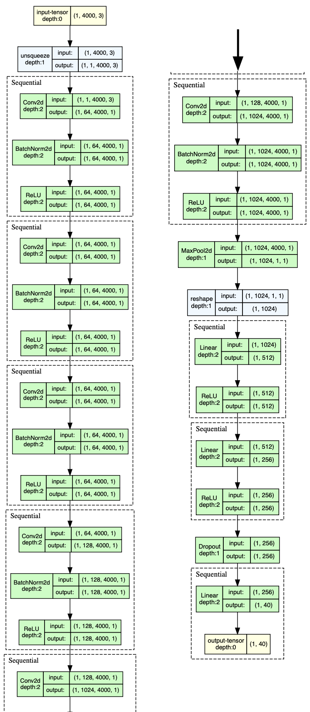

# 3D-Object-Classification
 
## Dataset 
We employ the [ModelNet40](https://modelnet.cs.princeton.edu/) dataset for our experiments. The dataset contains 12,311 3D models of 40 categories. The models are represented as point clouds with 3D coordinates and 3D normals.
Example of the dataset:

  
  

## Architectures

### 1. PointNet
The architecture of PointNet is shown below:

  

### 2. VoxelNet